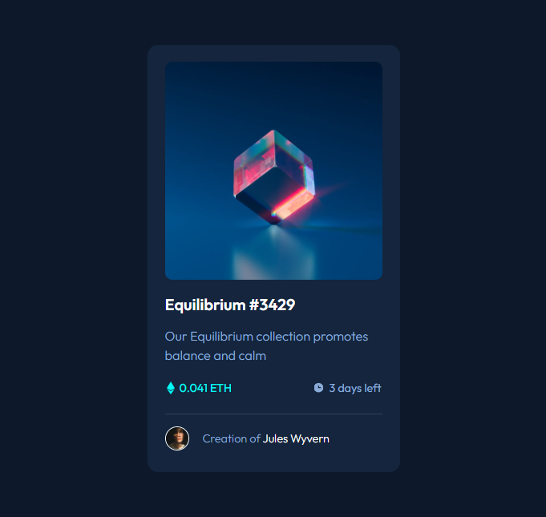
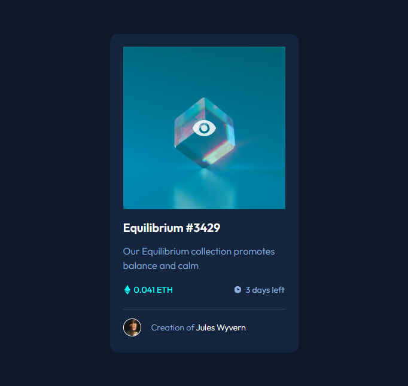

# Frontend Mentor - NFT preview card component solution

Essa é uma solução para o [NFT preview card component challenge on Frontend Mentor](https://www.frontendmentor.io/challenges/nft-preview-card-component-SbdUL_w0U). Frontend Mentor ajuda você a melhorar suas habilidades de codificação construindo projetos realistas..

## Índice

- [Visão geral](#visão-geral)
  - [O desafio](#o-desafio)
  - [Captura de tela](#captura-de-tela)
  - [Links](#links)
- [Meu processo](#meu-processo)
  - [Desenvolvido com](#desenvolvido-com)
  - [O que eu aprendi](#O-que-eu-aprendi)
  - [Desenvolvimento contínuo](#desenvolvimento-continuo)
- [Autor](#autor)

## Visão geral

### O desafio

Usuarios devem ser capaz de:

- Vizualizar o layout ideal, dependendo do tamanho da tela de seu dispositivo.
- Ver estados de foco, para elementos interativos.

### Captura de tela




### Links

- GitHub Repository: [https://github.com/ryaansouza/challenge-nft-preview-card-component](https://github.com/ryaansouza/challenge-nft-preview-card-component)
- Deploy: [https://ryaansouza.github.io/challenge-nft-preview-card-component/](https://ryaansouza.github.io/challenge-nft-preview-card-component/)

## My process

### Desenvolvido com

- HTML5
- CSS
- Flexbox
- Desktop-first workflow

### O que eu aprendi

Reforcei mais o conceito de pseudo-elementos com a utilização do "after" e "before". Com isso, também aprendi acessar os pseudos-elementos através da pseudo-classe "hover", como no codigo abaixo:

```css
.nft-card .image-link:hover::before{
    opacity: 0.4;
}
```

### Desenvolvimento Contínuo

Planejo continuar a reforçar conceitos que não estou tão familiarizado.

Também começar a utilizar ferramentas, tecnologias e estratégias que ainda não utilizei.

## Autor

- Linkedin - [Ryan Souza](https://www.linkedin.com/in/ryaansouza/)
